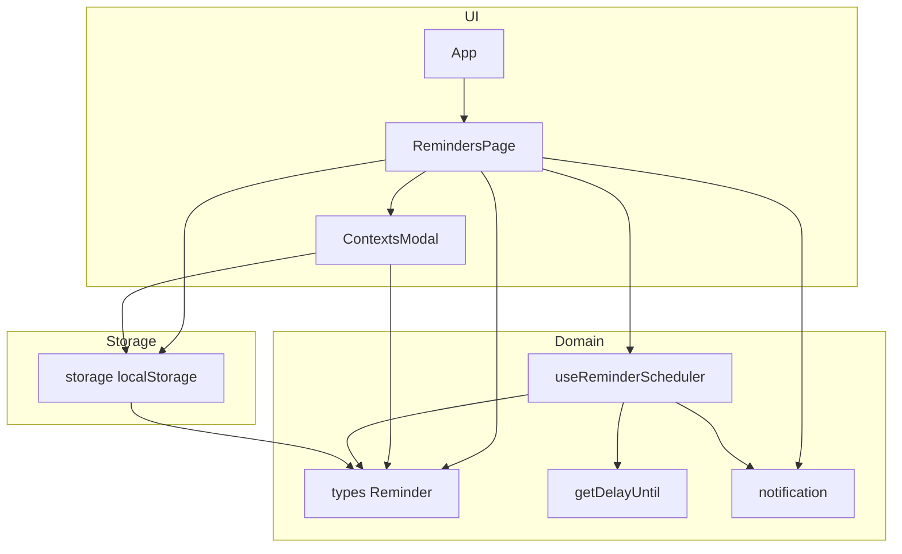

# Architecture

## 1. Общая архитектурная модель

Фронтенд-приложение Remindy построено как одностраничное приложение на React + Vite + TypeScript в парадигме **feature-first**:

- Вся доменная логика текущего продукта сосредоточена в фиче **reminders**.
- Для фичи используется слоистое разбиение:
  - `api` — работа с хранилищем (сейчас `localStorage`, в будущем может быть заменен на backend).
  - `hooks` — доменные хуки, инкапсулирующие бизнес-логику (планировщик напоминаний).
  - `lib` — утилиты домена (работа со временем, уведомления).
  - UI-компоненты страницы — `RemindersPage`, `ContextsModal`.

Верхнеуровневая структура `src`:

```text
src/
  App.tsx
  main.tsx
  App.css
  index.css
  assets/
  features/
    reminders/
      RemindersPage.tsx
      RemindersPage.css
      ContextsModal.tsx
      types.ts
      api/
        storage.ts
      hooks/
        useReminderScheduler.ts
      lib/
        time.ts
        notification.ts
  tests/
    setup.ts
  test-utils.tsx
```

## 2. Основные модули и их ответственность

### 2.1. Входная точка приложения

- [`src/main.tsx`](src/main.tsx) — монтирует React-приложение в DOM, подключает глобальные стили.
- [`src/App.tsx`](src/App.tsx) — корневой компонент приложения:
  - отображает заголовок **Remindy**;
  - рендерит страницу напоминаний [`RemindersPage`](src/features/reminders/RemindersPage.tsx).

Уровень роутинга пока отсутствует — по сути одноэкранное SPA.

### 2.2. Домен напоминаний

#### Типы

- [`src/features/reminders/types.ts`](src/features/reminders/types.ts)

Описание доменной сущности `Reminder`:

- `id: ReminderId` — уникальный идентификатор (алиас для `string`).
- `title: string` — заголовок (обязательное поле).
- `description?: string` — текстовое описание.
- `mediaUrl?: string` — ссылка на медиа.
- `remindsAt?: string` — дата/время напоминания в ISO-строке.
- `status: ReminderStatus` — статус напоминания (`"active" | "done"`).
- `context?: string` — контекст/тема для группировки.

Этот файл задает контракт между UI, хранилищем и планировщиком напоминаний.

#### Хранилище

- [`src/features/reminders/api/storage.ts`](src/features/reminders/api/storage.ts)

Ответственность: абстракция над механизмом хранения напоминаний и контекстов.

- `REMINDERS_STORAGE_KEY = "remindy:reminders"` — ключ для напоминаний в `localStorage`.
- `CONTEXTS_STORAGE_KEY = "remindy:contexts"` — ключ для контекстов в `localStorage`.

Функции для напоминаний:

- `loadReminders(): Reminder[]`:
  - читает JSON-строку из `localStorage`;
  - безопасно парсит данные:
    - при отсутствии данных возвращает пустой массив;
    - при ошибке `JSON.parse` возвращает пустой массив;
    - при не-массиве тоже возвращает пустой массив.
- `saveReminders(reminders: Reminder[]): void`:
  - сериализует массив напоминаний;
  - сохраняет в `localStorage`;
  - логирует ошибку в консоль при неудаче.

Функции для контекстов:

- `loadContexts(): string[]` — загрузка контекстов из localStorage.
- `saveContexts(contexts: string[]): void` — сохранение контекстов с дедупликацией.
- `addContext(context: string): void` — добавление нового контекста.
- `removeContext(context: string): void` — удаление контекста.
- `updateContext(oldContext: string, newContext: string): void` — переименование контекста.
- `getAllContexts(reminders: Reminder[]): string[]` — объединение сохраненных контекстов и контекстов из напоминаний.

Важно: UI не знает о деталях `localStorage` и взаимодействует только через этот модуль, что упрощает будущую замену на внешний API.

#### Утилиты времени

- [`src/features/reminders/lib/time.ts`](src/features/reminders/lib/time.ts)

Функция:

- `getDelayUntil(remindsAt: string, now: Date = new Date()): number | null`:
  - преобразует целевое время в миллисекунды;
  - проверяет валидность даты;
  - возвращает:
    - `null`, если дата некорректна;
    - `null`, если целевое время в прошлом или прямо сейчас;
    - положительную разницу в миллисекундах до события.

Этот модуль инкапсулирует логику вычисления задержки до напоминания и используется планировщиком.

#### Утилиты уведомлений

- [`src/features/reminders/lib/notification.ts`](src/features/reminders/lib/notification.ts)

Функции для работы с браузерными уведомлениями:

- `requestNotificationPermission(): Promise<NotificationPermission>` — запрос разрешения.
- `showNotification(options: NotificationOptions): Promise<void>` — показ уведомления.
- `canShowNotifications(): boolean` — проверка возможности показа.
- `getNotificationPermission(): NotificationPermission | null` — получение текущего статуса.

Интерфейс `NotificationOptions`:

- `title: string` — заголовок уведомления.
- `body: string` — текст уведомления.
- `icon?: string` — иконка.
- `tag?: string` — тег для замены уведомлений.

#### Планировщик напоминаний

- [`src/features/reminders/hooks/useReminderScheduler.ts`](src/features/reminders/hooks/useReminderScheduler.ts)

Назначение: наблюдать за списком напоминаний и запускать callback, когда наступает время ближайшего будущего напоминания.

Ключевые детали:

- Использует `useRef` для хранения текущего `timeoutId`.
- В `useEffect`:
  - очищает предыдущий таймер при каждом изменении `reminders`;
  - фильтрует только активные напоминания (`status !== "done"`);
  - фильтрует напоминания с заполненным `remindsAt`;
  - для каждого вычисляет задержку через `getDelayUntil`;
  - отбрасывает `null` (прошлое или некорректное время);
  - сортирует по возрастанию задержки;
  - планирует `setTimeout` на самое ближайшее событие;
  - при срабатывании таймера вызывает `showNotification()` с данными напоминания;
  - в cleanup повторно очищает таймер.

Слой планировщика полностью отделен от UI — он не знает ничего о компонентах и работает только с данными `Reminder` и функциями уведомлений.

### 2.3. Страница напоминаний

- [`src/features/reminders/RemindersPage.tsx`](src/features/reminders/RemindersPage.tsx)
- [`src/features/reminders/RemindersPage.css`](src/features/reminders/RemindersPage.css)

Ответственность: реализует весь пользовательский сценарий работы с напоминаниями в одном экране.

Основные элементы состояния:

- `reminders: Reminder[]` — текущий список напоминаний.
  - Инициализируется вызовом `loadReminders()` с защитой от пустых/битых данных.
  - Для старых записей без `status` устанавливается значение `"active"`.
- Поля формы создания:
  - `title`, `remindsAt`, `context`.
- Поля редактирования:
  - `editingId`, `editingTitle`, `editingRemindsAt`, `editingContext`.
- `contextsModalOpened` — состояние модального окна управления контекстами.
- `contextsList: string[]` — список доступных контекстов.
- `showPermissionBanner` — показ баннера запроса разрешения на уведомления.
- `dismissedPermissionBanner` — флаг скрытия баннера.
- `notificationPermission` — текущий статус разрешения на уведомления.

Ключевая логика:

- Инициализация: при первом рендере читает данные из localStorage через `loadReminders`.
- Подписка на планировщик: `useReminderScheduler(reminders)`.
- Сохранение в localStorage: `useEffect` наблюдает за `reminders` и вызывает `saveReminders(reminders)` при каждом изменении.
- Управление контекстами:
  - Загрузка списка контекстов через `getAllContexts(reminders)`.
  - Обновление списка при изменении напоминаний.
  - Обработка событий переименования и удаления контекстов с синхронизацией напоминаний.
- Управление уведомлениями:
  - Проверка разрешения при загрузке.
  - Показ баннера запроса разрешения.
  - Запрос разрешения по кнопке.
  - Сохранение состояния скрытия баннера в localStorage.
- Создание напоминания:
  - Валидация: пустой `title` блокирует создание.
  - Обработка `remindsAt`:
    - парсинг введенного значения `datetime-local` в `Date`;
    - проверка валидности;
    - хранение в ISO-формате (`toISOString()`), если валидно.
  - Установка статуса `"active"` по умолчанию.
  - Очищает поля формы после успешного добавления.
- Удаление напоминания:
  - фильтрация по `id`;
  - сброс режима редактирования, если удаляется редактируемый элемент.
- Переключение статуса:
  - `handleToggleStatus` меняет статус между `"active"` и `"done"`.
- Редактирование:
  - `handleStartEdit`:
    - переносит поля напоминания в `editing*`;
    - для `remindsAt` выполняет преобразование ISO → локальный формат `YYYY-MM-DDTHH:mm`, учитывая `timezoneOffset`.
  - `handleSaveEdit`:
    - валидация `editingTitle`;
    - обработка `editingRemindsAt` аналогично созданию;
    - обновление нужного элемента в массиве.
  - `handleCancelEdit` — сброс `editingId`.
- Группировка напоминаний:
  - Напоминания группируются по полю `context`.
  - Контекст без значения группируется как "Без контекста".
  - Группы сортируются по алфавиту.

UI-слой:

- Использует компоненты Mantine (`Card`, `TextInput`, `Textarea`, `Stack`, `Group`, `Button`, `Text`, `Checkbox`, `Badge`, `Autocomplete`, `ActionIcon`, `Alert`, `Title`).
- Делит экран на два блока:
  - Левая колонка — форма создания напоминания.
  - Правая колонка — список напоминаний, баннер запроса разрешений и карточки.
- В карточках:
  - режим отображения/редактирования;
  - чекбокс для переключения статуса;
  - визуальная индикация выполненных (зачёркнутый текст, бейдж "Выполнено");
  - вывод даты `remindsAt` через `toLocaleString`;
  - вывод контекста в заголовке группы;
  - кнопки редактирования и удаления.

CSS:

- [`RemindersPage.css`](src/features/reminders/RemindersPage.css) отвечает за базовую раскладку страницы и отступы (двухколоночный layout и т.п.).

### 2.4. Модальное окно управления контекстами

- [`src/features/reminders/ContextsModal.tsx`](src/features/reminders/ContextsModal.tsx)

Ответственность: предоставляет интерфейс для управления контекстами.

Основные элементы состояния:

- `editingId` — id редактируемого контекста.
- `editingValue` — значение редактируемого контекста.
- `newContext` — значение для создания нового контекста.

Ключевая логика:

- Загрузка контекстов: объединяет сохраненные контексты и контексты из напоминаний.
- Создание контекста:
  - Валидация непустого значения.
  - Добавление через `addContext()`.
  - Обновление UI через `onContextUpdate()`.
- Редактирование контекста:
  - Переключение в режим редактирования.
  - Сохранение через `updateContext()`.
  - Синхронизация с напоминаниями через `onContextRenamed()`.
- Удаление контекста:
  - Удаление через `removeContext()`.
  - Синхронизация с напоминаниями через `onContextDeleted()` (очистка поля `context`).

UI-слой:

- Использует компоненты Mantine (`Modal`, `Stack`, `TextInput`, `Button`, `Group`, `Text`, `ActionIcon`, `Divider`).
- Два блока:
  - Создание нового контекста.
  - Список существующих контекстов с кнопками редактирования и удаления.

## 3. Слои и зависимости

### 3.1. Слои

Упрощенная слоистая модель:

- UI:
  - [`App.tsx`](src/App.tsx)
  - [`RemindersPage.tsx`](src/features/reminders/RemindersPage.tsx)
  - [`ContextsModal.tsx`](src/features/reminders/ContextsModal.tsx)
  - CSS-стили и компоненты Mantine.
- Доменная логика:
  - [`useReminderScheduler.ts`](src/features/reminders/hooks/useReminderScheduler.ts)
  - [`time.ts`](src/features/reminders/lib/time.ts)
  - [`notification.ts`](src/features/reminders/lib/notification.ts)
  - [`types.ts`](src/features/reminders/types.ts)
- Хранилище:
  - [`storage.ts`](src/features/reminders/api/storage.ts)

Направление зависимостей:

- UI зависит от домена и хранилища.
- Доменная логика (`hooks`, `lib`) зависит только от типов и стандартных API.
- Хранилище зависит от типов и браузерного `localStorage`.

### 3.2. Диаграмма потоков



## 4. Тесты

Основные тестовые файлы:

- [`src/features/reminders/api/storage.test.ts`](src/features/reminders/api/storage.test.ts)
- [`src/features/reminders/hooks/useReminderScheduler.test.ts`](src/features/reminders/hooks/useReminderScheduler.test.ts)
- [`src/features/reminders/lib/time.test.ts`](src/features/reminders/lib/time.test.ts)
- [`src/features/reminders/RemindersPage.test.tsx`](src/features/reminders/RemindersPage.test.tsx)
- [`src/tests/setup.ts`](src/tests/setup.ts)
- [`src/test-utils.tsx`](src/test-utils.tsx)
- e2e-тесты Playwright:
  - [`e2e/reminders.spec.ts`](e2e/reminders.spec.ts)
  - [`e2e/example.spec.ts`](e2e/example.spec.ts)

Общий подход:

- Юнит-тесты покрывают:
  - вычисление задержки до напоминания;
  - планировщик напоминаний;
  - работу хранилища;
  - поведение страницы напоминаний (через Testing Library и jsdom).
- E2E-тесты проверяют сценарии на уровне браузера (через Playwright).

## 5. Инфраструктура и сборка

- [`vite.config.ts`](vite.config.ts) — конфигурация Vite с PWA:
  - React-плагин `@vitejs/plugin-react`.
  - PWA-плагин `vite-plugin-pwa`:
    - Manifest с названием "Remindy", иконками, цветовой схемой.
    - Workbox для кэширования ресурсов.
    - Runtime кэширование для Google Fonts.
    - Базовый путь `/reminder-app/` для GitHub Pages.
- TypeScript:
  - [`tsconfig.json`](tsconfig.json) использует `references` на `tsconfig.app.json` и `tsconfig.node.json`.
- ESLint / Prettier:
  - [`eslint.config.js`](eslint.config.js)
  - [`.prettierrc`](.prettierrc)
  - [`.prettierignore`](.prettierignore)
- GitHub Actions:
  - [`.github/workflows/deploy.yml`](.github/workflows/deploy.yml) — автоматический деплой на GitHub Pages.

## 6. Готовность к будущему развитию

Текущая архитектура уже учитывает будущие шаги:

- **Расширение домена**:
  - добавление новых фич возможно через новые директории в `src/features`;
  - фича `reminders` может быть расширена дополнительными представлениями (календарь, таймлайн), которые будут жить как новые компоненты/страницы и переиспользовать существующий доменный слой.
- **Смена хранилища**:
  - логика `localStorage` инкапсулирована в `api/storage.ts`;
  - при подключении backend можно заменить реализацию или добавить новые функции, не ломая UI-код.
- **PWA и офлайн**:
  - Vite и разделение по слоям позволяют относительно просто добавить сервис-воркера и кэширование ресурсов;
  - локальное хранение напоминаний уже реализовано;
  - PWA инфраструктура уже настроена с базовым кэшированием.

Этот файл должен обновляться при:

- добавлении новых фич в `src/features`;
- изменении способа хранения данных;
- появлении новых слоев (например, глобального стейт-менеджмента или отдельного маршрутизатора).
